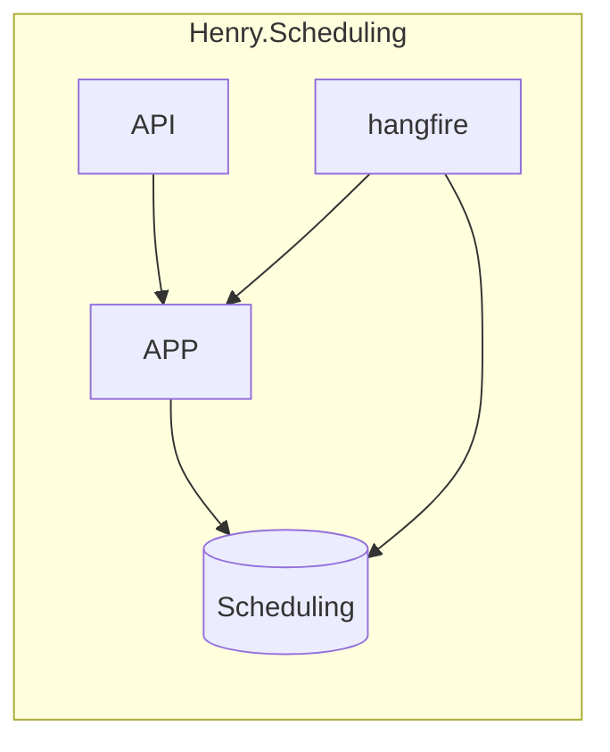

# henry-scheds for henry-meds

Small API for facilitating client-provider reservations (appointments)

## Overview

- A _provider_ can submit their schedule which generates a collection of _slots_ within the system
    - Each _slot_ is 15 minutes in duration
- A _client_ can obtain a list of available slots
    - A _slot_ can be reserved thereby generating an _appointment_ within the system
    - An _appointment_ will [auto-expire](https://github.com/jrandallsexton/henry-scheds/blob/main/src/Henry.Scheduling.Api/Infrastructure/Jobs/ReservationExpiryJob.cs) if not confirmed within 15 minutes of creation
    - An _appointment_ cannot be created for a slot within 24 hours of the _slot_'s specified time
## Decisions
- [Vertical Slice Architecture](https://www.jimmybogard.com/vertical-slice-architecture/)
- Use of [MediatR](https://github.com/jbogard/MediatR) and [CQRS](https://martinfowler.com/bliki/CQRS.html) pattern for handling API actions
- SQL Server for persistence
- [FluentValidation](https://docs.fluentvalidation.net/en/latest/) for ensuring integrity of commands and queries
- [Automapper](https://automapper.org/) for simple mapping of entities to DTOs
- [MediatR](https://github.com/jbogard/MediatR) handlers use dbContext directly instead of a repository (time constraints)
- [Hangfire](https://www.hangfire.io/) for the [cron job](https://github.com/jrandallsexton/henry-scheds/blob/main/src/Henry.Scheduling.Api/Infrastructure/Jobs/ReservationExpiryJob.cs) that expires reservations not confirmed within 30 minutes
    - Cron job fires every minute
    - Reservations not confirmed within 30 minutes are passed off via fire-and-forget to another MediatR [handler](https://github.com/jrandallsexton/henry-scheds/blob/main/src/Henry.Scheduling.Api/Application/Appointment/Commands/ExpireAppointment.cs) for expiry process
    - Should something happen with the handler, the cron job would send it for expiry the following minute
    - Automatically retries jobs (configurable)
    - Dashboard is available at [_/dashboard_](https://localhost:63632/dashboard)
- Unit Testing
    - [XUnit](https://xunit.net/) for framework
    - [FluentAssertions](https://fluentassertions.com/) for test assertions
    - [SQL Server In-Memory](https://www.nuget.org/packages/Microsoft.EntityFrameworkCore.InMemory/) for dbContext setups
    - Log statements are constructed for [structured logging](https://learn.microsoft.com/en-us/aspnet/core/fundamentals/logging/?view=aspnetcore-8.0)
## Missing
- Structured logging provider not implemented
- Integration testing which would use [TestContainers](https://testcontainers.com/) to spin up the environment within Docker and perform actual HTTP requests against endpoints
- [Transactional Outbox Pattern](https://microservices.io/patterns/data/transactional-outbox.html) for integration events (generally via some sort of event bus)
- No repositories exist; direct usage of dbContext within MediatR handlers
- No authentication or authorization
- Unit testing is minimal; only a couple of classes implemented to show general testing setups (TDD not utilized)

## Running the Service
- Docker Compose file is provided; set the startup project to it
- Book an appointment:
    - GET to api/clients. Save a clientId.
    - GET to api/slots. Save the slotId.
- Confirm an appointment
    - POST to api/appointments. Provide body shown in Swagger.
        - < 24 hour rule will be honored (denied)
        - \> 24 hour rule will create appointment
        - save the appointmentId returned by the POST
            - due to time constraints and lack of user awareness, you'll still need to provide a body along with the id in the url
            - the appointmentId will be returned with a 200(Ok)
- Provider schedule:
    - POST to api/providers/{id}/schedule
        - handler will create slots based on start/end utc dateTimes

## Closing Thoughts
- Project should have just been named Henry.Scheduling and not Henry.Scheduling.Api
- Postman collection should have been updated to use a variable for the root url
- MediatR handlers should likely be using some sort of ServiceResult<T> instead of a DTO
- Many of the classes within the Application namespace are empty - placed there to show more about my thought process and how the pattern I chose would look over-time
- As of recent, I have really begun to rethink the usage of the [ExceptionHandlingMiddleware](https://github.com/jrandallsexton/henry-scheds/blob/main/src/Henry.Scheduling.Api/Middleware/ExceptionHandlingMiddleware.cs) and want to change it - but this is a tried & true pattern that I know works. Drawback?  Exceptions are expensive and there are better ways of returning the correct HTTP result to the API client
- Instead of _Provider_ and _Client_ entities, it really should have been more _User-centric_ and allowed the application to obtain required IDs for commands/queries to be determined via HTTP Context
- Exercise was stated to be completed within 2-3 hours; this was done in roughly 4-5 hours
- Most of the code (except for _domain-specific_ items) was recycled from previous projects
- MediatR handlers use nested classes; this is not normal and can easily be reworked. This approach, however, makes the handler a self-contained unit.  For people unaccustomed to working with this pattern, it might seem odd.
- So much more work could be done on this, but time constraints simply do not allow.  Nothing worse for a dev than to be forced to have half-written code exposed for the world to see.
- EF entities are not optimized; better structure could likely be had
- No caching is involved for getting a list of available slots
- Perhaps your team prefers:
    - minimal APIs
    - separate assemblies for contracts or some other relation of classes
    - global/implicit usings
    - usings within namespaces
    - 1:1 ratio b/w files/classes (the norm)
    - “You can please some of the people all of the time, you can please all of the people some of the time, but you can’t please all of the people all of the time”
- etc., etc., etc.
## Diagram
- Diagram created using [Mermaid](https://mermaid.js.org/)
- Better diagram showing how this service should really fit into a microservices-based architecture can be found [here](https://github.com/jrandallsexton/sports-data-core)
